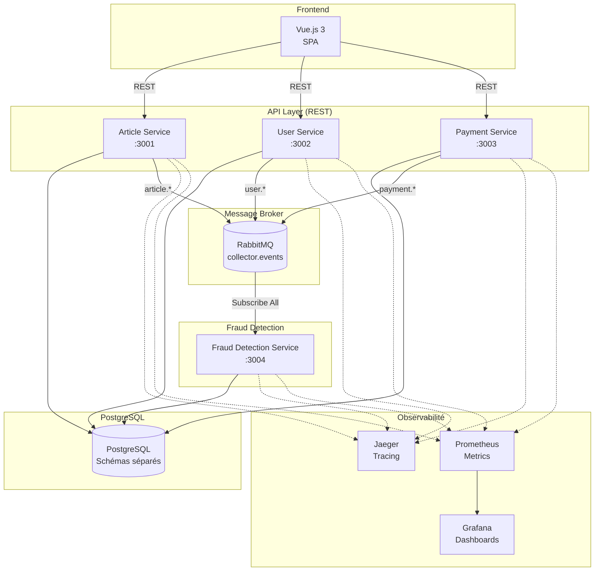

# Collector.shop - Architecture Documentation

## Overview

Collector.shop est une marketplace d'objets de collection entre particuliers avec détection de fraudes en temps réel.

## Stack Technique

| Composant | Technologie |
|-----------|-------------|
| Backend | NestJS (TypeScript) |
| Base de données | PostgreSQL |
| Message Broker | RabbitMQ |
| Frontend | Vue.js 3 |
| Orchestration | Kubernetes (Minikube) |
| Tracing | Jaeger |
| Metrics | Prometheus + Grafana |

## Diagramme d'Architecture



## Microservices

### 1. Article Service (Port 3001)
- **Responsabilité** : Gestion CRUD des articles de collection
- **Base** : PostgreSQL (schéma `articles`)
- **Événements émis** : `ArticleCreated`, `ArticleUpdated`, `PriceChanged`
- **Communication** : REST (entrée) + RabbitMQ (sortie)

### 2. User Service (Port 3002)
- **Responsabilité** : Gestion utilisateurs, authentification JWT
- **Base** : PostgreSQL (schéma `users`)
- **Événements émis** : `UserRegistered`, `UserUpdated`
- **Communication** : REST (entrée) + RabbitMQ (sortie)

### 3. Payment Service (Port 3003)
- **Responsabilité** : Simulation des transactions d'achat
- **Base** : PostgreSQL (schéma `payments`)
- **Événements émis** : `PaymentInitiated`, `PaymentCompleted`, `PurchaseCompleted`
- **Communication** : REST (entrée) + RabbitMQ (sortie)

### 4. Fraud Detection Service (Port 3004)
- **Responsabilité** : Détection de fraudes en temps réel
- **Base** : PostgreSQL (schéma `fraud`)
- **Règles de détection** :
  - Variation prix > 500% en 1h → Alerte ORANGE
  - Variation prix > 1000% en 1h → Alerte ROUGE
  - Plus de 5 achats/user en 10min → Alerte ORANGE
  - Plus de 10 achats/user en 10min → Alerte ROUGE
- **Communication** : RabbitMQ (entrée uniquement, événementiel pur)
- **Metrics** : Expose compteurs Prometheus par type/niveau de fraude

## Communication

### REST API
```
Frontend ←→ Article Service  (CRUD articles)
Frontend ←→ User Service     (Auth, profil)
Frontend ←→ Payment Service  (Transactions)
```

### RabbitMQ Events
```
Exchange: collector.events (type: topic)

Routing Keys:
├── article.created
├── article.updated
├── article.price_changed
├── user.registered
├── user.updated
├── payment.initiated
├── payment.completed
└── payment.purchase_completed
```

## Schémas PostgreSQL

Chaque service utilise son propre schéma dans la même instance PostgreSQL :
- `articles` - Article Service
- `users` - User Service  
- `payments` - Payment Service
- `fraud` - Fraud Detection Service
